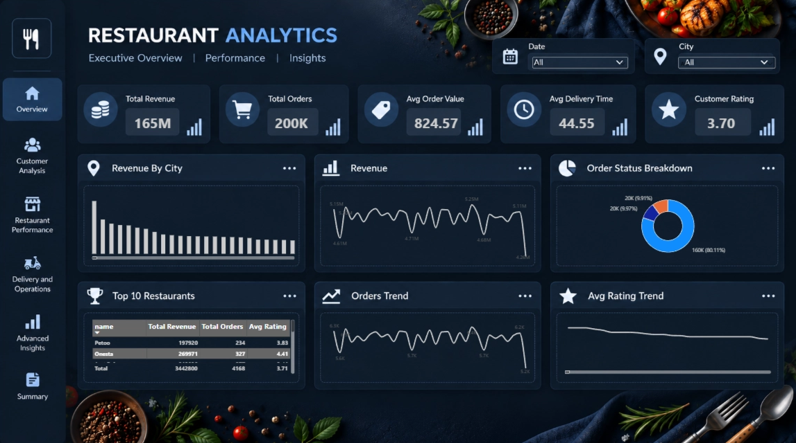
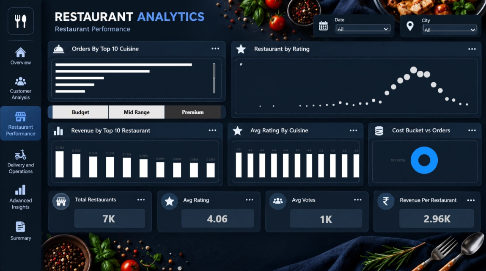
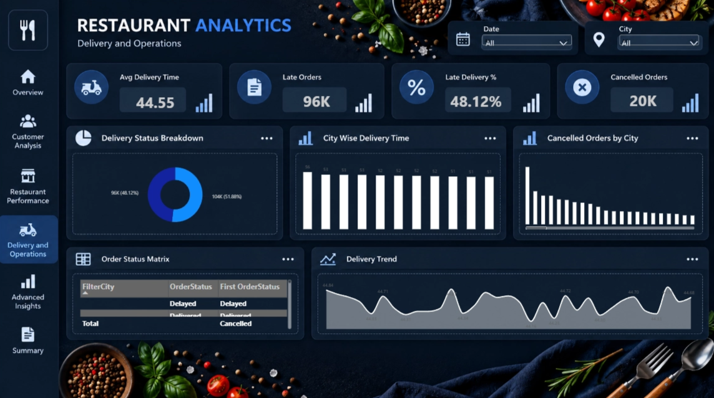
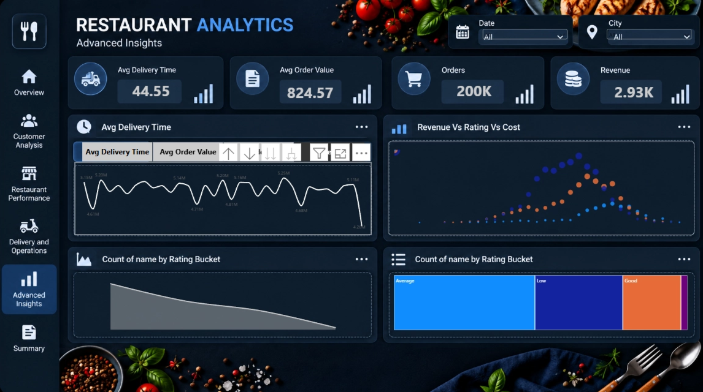

# 🍽️ Restaurant Analytics — Power BI Dashboard

<p align="center">


</p>

<p align="center">


</p>

---

# 📌 Project Overview

The **Restaurant Analytics Dashboard** is an interactive Power BI Business Intelligence project designed to analyze restaurant sales, customer behavior, restaurant performance, delivery operations, ratings, and business trends.

The project transforms raw restaurant and order data into an interactive analytical solution that helps stakeholders understand business performance and identify operational opportunities.

---

# 🎯 Business Problem

Restaurant businesses generate large volumes of data across orders, customers, restaurants, revenue, ratings, and delivery operations.

Without a centralized analytical dashboard, it becomes difficult to:

- Monitor revenue and order performance
- Understand customer behavior
- Identify high-performing restaurants
- Analyze ratings and customer satisfaction
- Track delivery delays
- Understand cancellation patterns
- Compare restaurant and city performance
- Identify opportunities for operational improvement

---

# 🎯 Project Objective

The objective of this project is to develop an interactive Power BI dashboard that provides a centralized view of restaurant business performance.

The dashboard focuses on:

- Revenue analysis
- Order analysis
- Customer behavior
- Restaurant performance
- Delivery operations
- Ratings analysis
- Advanced business insights

---

# 🛠️ Tools & Technologies

| Tool | Purpose |
|---|---|
| **Power BI** | Dashboard development & visualization |
| **DAX** | Measures & analytical calculations |
| **Power Query** | Data cleaning & transformation |
| **Excel / CSV** | Dataset |
| **Data Modeling** | Relationships & analytical structure |

---

# 📊 Dashboard Pages

The project contains **7 interactive dashboard pages**.

---

## 01 — 📊 Executive Overview

Provides a high-level overview of restaurant business performance.

### Focus Areas

- Total revenue
- Total orders
- Average rating
- Overall KPIs
- Revenue trends
- Order trends
- Business performance overview

### Preview



---

## 02 — 👥 Customer Analytics

Analyzes customer behavior and customer engagement.

### Focus Areas

- Customer segmentation
- Repeat customers
- Customer behavior
- Signup trends
- Customer activity
- Retention-related analysis

### Preview


---

## 03 — 🍽️ Restaurant Performance

Compares restaurant performance across different business metrics.

### Focus Areas

- Top restaurants
- Restaurant revenue
- Order volume
- Cuisine performance
- Restaurant ratings
- Restaurant comparisons

### Preview



---

## 04 — 🚚 Delivery & Operations

Analyzes delivery performance and operational efficiency.

### Focus Areas

- Delivery time
- Late deliveries
- Cancellation analysis
- Delivery performance
- Operational trends
- Order fulfillment

### Preview



---

## 05 — 🔎 Advanced Insights

Provides deeper analysis using calculated metrics and relationships between business variables.

### Focus Areas

- Order value
- Rating buckets
- Revenue relationships
- Cost analysis
- Customer behavior
- Advanced KPI analysis

### Preview



---

## 06 — 🏪 Restaurant Details

Provides detailed restaurant-level analysis.

### Focus Areas

- Restaurant performance
- Revenue
- Orders
- Ratings
- Customer activity
- Operational metrics

### Preview


---

## 07 — 📈 Summary

Provides a consolidated view of the major findings from the complete analysis.

### Focus Areas

- Revenue performance
- Order performance
- Customer insights
- Restaurant performance
- Delivery efficiency
- Ratings
- Key business findings

### Preview


---

# 🔍 Key Business Insights

### 💰 Revenue & Orders

The dashboard analyzes **200K+ orders** and approximately **₹165M in revenue**, providing visibility into overall business scale and performance.

### ⭐ Customer Satisfaction

The overall average rating is approximately **3.70**, allowing customer experience to be analyzed across restaurants and other business segments.

### 🚚 Delivery Performance

Approximately **48.12% of deliveries are identified as late**, highlighting delivery performance as an important operational area for analysis.

### 👥 Customer Behavior

Customer analysis provides visibility into repeat customers, customer activity, and signup patterns.

### 🍽️ Restaurant Performance

Restaurant-level analysis enables comparison of revenue, orders, ratings, and cuisine performance.

### 📦 Operational Performance

Delivery and cancellation analysis helps identify operational patterns that can affect customer experience and business performance.

---

# 💡 Business Solution

The dashboard provides a centralized Business Intelligence solution for restaurant stakeholders.

It can be used to:

- Monitor revenue and order KPIs
- Track restaurant performance
- Understand customer behavior
- Analyze customer ratings
- Monitor delivery efficiency
- Investigate cancellation patterns
- Compare restaurants and cuisines
- Identify operational improvement opportunities

---

# 📈 Business Impact

The analytical solution helps stakeholders:

- Monitor business performance from a single dashboard
- Identify important revenue and order trends
- Understand customer behavior
- Compare restaurant performance
- Track delivery efficiency
- Monitor customer satisfaction
- Support data-driven operational decisions

---

# 🧠 Analytical Capabilities

| Capability | Implementation |
|---|---|
| KPI Analysis | Power BI Cards |
| Revenue Analysis | DAX Measures |
| Order Analysis | KPI & Trend Visuals |
| Customer Analysis | Segmentation & Trends |
| Restaurant Comparison | Bar & Column Charts |
| Delivery Analysis | Operational KPIs |
| Rating Analysis | Rating Distribution |
| Trend Analysis | Line Charts |
| Interactive Filtering | Slicers |
| Drill-through | Restaurant-level analysis |
| Data Transformation | Power Query |
| Data Modeling | Power BI Relationships |

---

# 📂 Repository Structure

```text
Restaurant-Analytics/
│
├── README.md
│
├── Dashboard/
│   └── Restaurant_Analytics.pbix
│
├── Screenshots/
│   ├── 01-executive-overview.png
│   ├── 02-customer-analytics.png
│   ├── 03-restaurant-performance.png
│   ├── 04-delivery-operations.png
│   ├── 05-advanced-insights.png
│   ├── 06-restaurant-details.png
│   └── 07-summary.png
│
├── Dataset/
│   └── README.md
│
└── .gitignore
