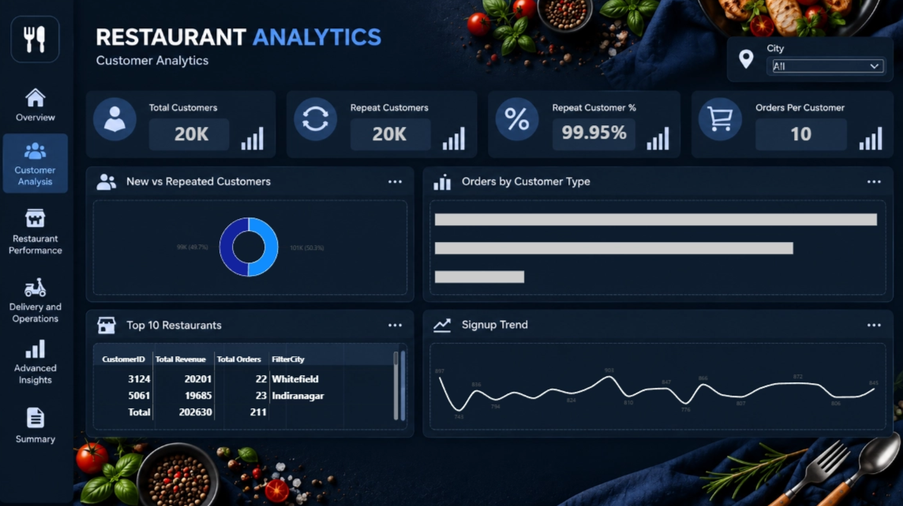
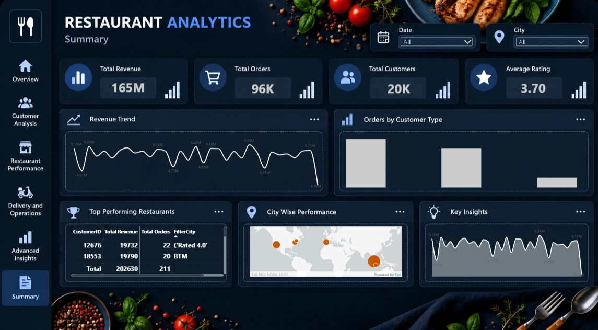

# 🍽️ Restaurant Analytics | Power BI

An interactive, six-page Power BI portfolio project exploring restaurant and food-delivery data across revenue, customer behavior, restaurant performance, delivery operations, and business insights.

> **Project goal:** Transform restaurant order data into clear, actionable insights through interactive dashboards.

## 📌 Project Overview

Restaurant businesses generate large volumes of order data, making it challenging to monitor revenue, customer behavior, restaurant performance, and delivery operations in one place.

This project uses Microsoft Power BI to organize key performance indicators (KPIs) and trends into a multi-page report, helping users explore business performance and identify areas that may need attention.

### Business Problem

How can restaurant and food-delivery businesses use order data to understand performance, explore customer behavior, compare restaurants, and identify delivery inefficiencies?

### Objectives

- Monitor key business performance indicators.
- Analyze customer activity and repeat-order behavior.
- Compare restaurant performance using relevant metrics.
- Explore delivery trends, delays, and cancellations.
- Communicate findings through clear, interactive dashboards.

## 🧰 Tools & Skills

- Microsoft Power BI
- Power Query *(include if used)*
- DAX *(include if used)*
- Data visualization and KPI analysis
- Business intelligence and data storytelling

## 📊 Dashboard Pages

| # | Dashboard | Focus |
|---|---|---|
| 01 | Executive Overview | Overall KPIs, revenue, orders, ratings, and order trends |
| 02 | Customer Analysis | Customer activity, repeat customers, orders per customer, and signup trends |
| 03 | Restaurant Performance | Cuisine, restaurant revenue, ratings, cost buckets, and restaurant-level KPIs |
| 04 | Delivery & Operations | Delivery time, late deliveries, cancellations, delivery status, and city-level operations |
| 05 | Advanced Insights | Delivery time, average order value, revenue/rating/cost relationships, and rating buckets |
| 06 | Summary | Consolidated KPIs, revenue trends, customer types, restaurant performance, and city insights |

## 🖼️ Dashboard Screenshots

### 01 — Executive Overview


### 02 — Customer Analysis


### 03 — Restaurant Performance


### 04 — Delivery & Operations


### 05 — Advanced Insights


### 06 — Summary


## 🔍 Key Insights

Add the final, validated insights from your dashboard pages here.

- **Revenue:** [Add a verified revenue trend or finding.]
- **Customer behavior:** [Add a verified repeat-customer or ordering-pattern finding.]
- **Restaurant performance:** [Add a verified restaurant/cuisine comparison.]
- **Delivery operations:** [Add a verified late-delivery, cancellation, or delivery-time finding.]

> Verify every number and interpretation against the final PBIX before publishing.

## 💡 Business Recommendations

Tailor recommendations to the evidence in your report. Potential areas to consider:

- Investigate key contributors to late deliveries and prioritize operational improvements.
- Use customer behavior patterns to inform retention initiatives.
- Review restaurant-level performance to identify practices worth replicating and areas needing support.
- Track customer ratings alongside delivery and order metrics to identify service-quality opportunities.
- Monitor KPIs over time to assess the impact of operational changes.

## 📁 Repository Structure

```text
Restaurant-Analytics-PowerBI/
│
├── Dashboard/
│   ├── Restaurant_Analytics.pbix
│   └── README.md
│
├── Screenshots/
│   ├── 01-executive-overview.png
│   ├── 02-customer-analysis.png
│   ├── 03-restaurant-performance.png
│   ├── 04-delivery-operations.png
│   ├── 05-advanced-insights.png
│   └── 06-summary.png
│
├── Dataset/
│   └── README.md
│
├── README.md
└── .gitignore
```

## ▶️ How to View

1. Download or clone this repository.
2. Open `Dashboard/Restaurant_Analytics.pbix` in Microsoft Power BI Desktop.
3. If prompted, update the data-source path to your local dataset location.
4. Refresh the data if required, then navigate through the six report pages.

## 🔗 Project Links

- **Notion Case Study:** [Add your published Notion link]
- **Power BI Service Report:** [Add link if published]
- **GitHub Repository:** [Add repository link]

## 👤 Author

**Rohit Kumar**

- GitHub: [Add your GitHub profile link]
- LinkedIn: [Add your LinkedIn profile link]

## ⚠️ Before Publishing

- Add your actual `.pbix` file to the `Dashboard/` folder.
- Replace all bracketed placeholders.
- Add your verified dashboard insights.
- Document dataset source and usage terms in `Dataset/README.md`.
- Do not upload confidential, licensed, or personally identifiable data.
